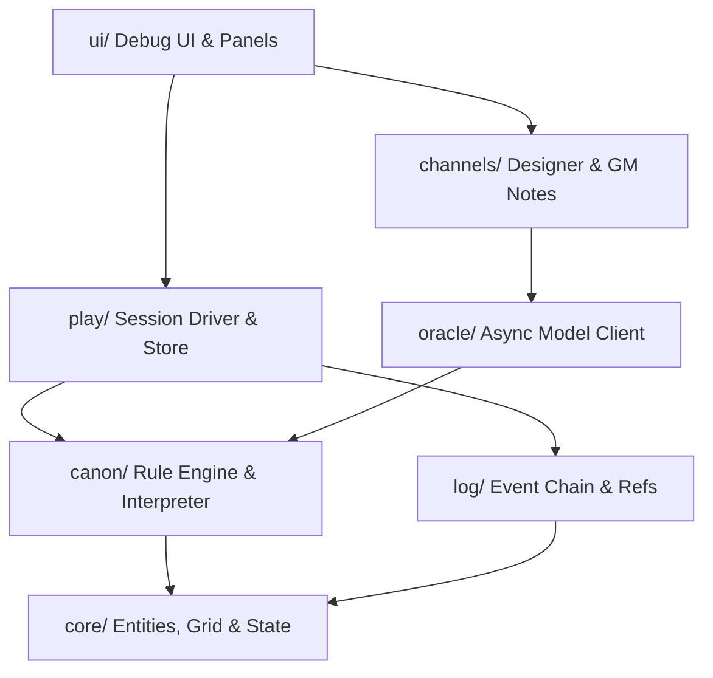
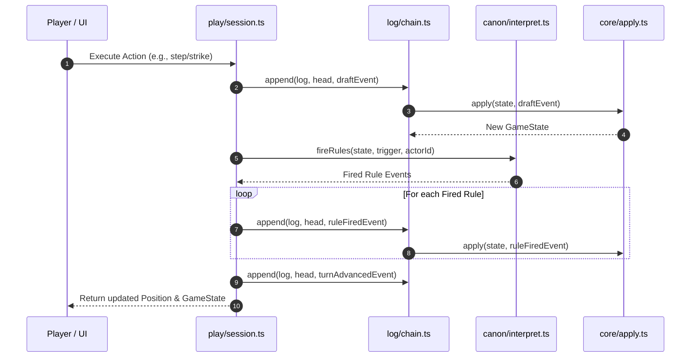

# System Architecture Overview

`evolving-rpg` is engineered around strict functional purity, content-addressed event logs, and non-blocking asynchronous model operations. The architecture guarantees that game mechanics remain 100% deterministic, reproducible, and decoupled from network calls or UI rendering.

---

## Architectural Layers & Dependencies

The codebase is organized into distinct, unidirectional module layers. Higher-level layers depend on lower-level layers, but lower layers never import from higher layers.

*Figure 1: Module dependency hierarchy and flow of authority.*

### Layer Responsibilities

1. **`core/` (Pure Engine)**
   - Defines the core data structures: `GameState`, `Entity`, `Stats` (HP, Might, Wits, Speed), `Item`, and `Grid`.
   - Houses the deterministic event reducer `apply(state, event)` in `src/core/apply.ts`.
   - Manages seeded random number generation via `src/core/rng.ts`.
   - Has **zero dependencies** on external modules, DOM, or network.

2. **`log/` (History & State Derivation)**
   - Manages the append-only event log (`EventLog`) in `src/log/chain.ts`.
   - Implements content-addressed event hashing using SHA-256 in `src/log/hash.ts`.
   - Provides world ref management (`fork`, `reset`, `getRef`) in `src/log/refs.ts`.
   - Handles schema versioning and upcasting in `src/log/upcast.ts`.
   - Derives canon state by folding event chains: `fold(log, head)`. Depends solely on `core/`.

3. **`canon/` (Rules & Provenance)**
   - Defines the R2 declarative rule schema (`Trigger`, `Condition`, `Effect`, `Rule`) and safety bounds in `src/canon/rule.ts`.
   - Evaluates rule triggers against game state during action resolution via `fireRules` in `src/canon/interpret.ts`.
   - Depends on `core/` and `log/`.

4. **`oracle/` (Asynchronous Model Bridge)**
   - Manages asynchronous queries to language models via `ask()` and `consult()` in `src/oracle/oracle.ts`.
   - Enforces the non-blocking invariant: game turns never wait for model completions.
   - Provides transport abstractions (`stub`, `cli`, `sdk`, `artifact`) in `src/oracle/transports.ts`.
   - Implements content-keyed caching where cached responses form the permanent canon. Depends on `canon/`.

5. **`play/` (Session Driver & Orchestration)**
   - Coordinates player input, AI creature turns (`decide`), rule evaluations, turn advancements, and death rewinds in `src/play/session.ts`.
   - Manages LocalStorage serialization and session verification in `src/play/store.ts`.
   - Depends on `core/`, `log/`, `canon/`, and `oracle/`.

6. **`channels/` (Designer & Gamemaster Feedback)**
   - Provides out-of-world (`designer`) and in-world (`gamemaster`) note channels in `src/channels/channels.ts`.
   - Captures contextual state (`where`, `turn`, `head`) alongside user feedback.

7. **`server/` (Development Server Plugins)**
   - Vite dev-server plugins in `server/oracle-plugin.ts` (proxies Oracle queries to `claude` CLI) and `server/chronicle-plugin.ts` (persists chronicle logs).

---

## State Flow & Functional Reducer Paradigm

Game state transition is governed by a single pure reducer function:

$$\text{GameState}_{n+1} = \text{apply}(\text{GameState}_n, \text{GameEvent}_{n+1})$$

Every state modification is recorded as a `GameEvent`. Events carry explicit schema versions and `rngDraws` counts to ensure that event replay reproduces state byte-for-byte.

*Figure 2: Sequence of action dispatch, rule evaluation, and log append within a single player turn.*

For details on how event logs enforce immutability through parent-hashing, see [Content-Addressed Event Log](/openwiki/domain/event-log.md).

---

## Non-blocking Oracle Architecture

To maintain smooth gameplay, model interactions operate out-of-band:

1. **Instant Resolution**: When a new entity or encounter requires narration or naming, `Oracle.ask()` returns an immediate, deterministic fallback name (`fallbackFor`).
2. **Background Query**: The Oracle raises the request to the active transport in the background.
3. **Canon Cache Promotion**: Once the transport responds with structured JSON, the answer is saved in the Oracle's cache (`canon`). Subsequent calls for the same key return the canon answer instantly.

This decoupled architecture is detailed further in [Oracle & Feedback Channels](/openwiki/integrations/oracle-channels.md), which details prompt structures and transport proxies.

---

## Cross-Module Links

- State management and log verification are detailed in [Content-Addressed Event Log](/openwiki/domain/event-log.md).
- Rule evaluation and safety bounds are specified in [The Ladder & Rule Vocabulary](/openwiki/domain/ladder.md).
- Action execution loops and turn management are documented in [Turn Execution Loop & Session Driver](/openwiki/workflows/turn-loop.md).
- File structure and component locations are indexed in [Source Map](/openwiki/source-map.md).
