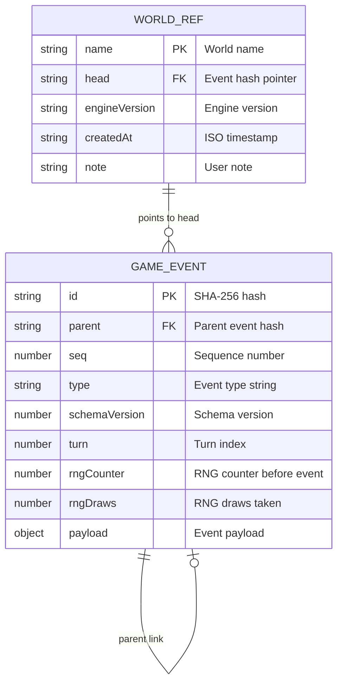

# Content-Addressed Event Log & History

In `evolving-rpg`, worlds are not stored as mutable database records or git branches. Instead, history is recorded as a **content-addressed, append-only event log** (`EventLog`). All game state is strictly derived by folding event chains from history:

$$\text{GameState} = \text{fold}(\text{log}, \text{head}) = \text{chain}(\text{log}, \text{head}).\text{reduce}(\text{apply}, \text{EMPTY\_STATE})$$

---

## Event Structure & Content-Addressed Hashing

Every historical occurrence is sealed into a frozen `GameEvent` object. Event IDs are calculated as the SHA-256 digest of the event's normalized draft payload, parent hash, and sequence index.

```typescript
export interface Envelope {
  readonly type: EventType;
  readonly schemaVersion: number;
  readonly turn: number;
  readonly rngCounter: number;
  readonly rngDraws: number;
}

export type GameEvent = Envelope & {
  readonly id: string;           // SHA-256 hash
  readonly parent: string | null; // Hash of predecessor event
  readonly seq: number;          // Monotonically increasing 0-based sequence
  readonly payload: EventPayload;
};
```

### Deterministic Hashing Mechanism (`src/log/hash.ts`)

1. **Canonical JSON**: `canonicalJson` (`src/log/canonical.ts`) serializes event drafts into stringified JSON with sorted object keys, eliminating key-order variance across JS engines.
2. **SHA-256 Calculation**: `@noble/hashes/sha256` computes a 64-character lowercase hex digest over the UTF-8 bytes of `{ draft, parent, seq }`.



*Figure 1: Entity-Relationship diagram between World Refs and Content-Addressed Game Events.*

---

## Append, Chain, and Fold (`src/log/chain.ts`)

- **`append(log, head, draft)`**:
  Calculates the hash `id` for `draft` at `head`. If an identical event already exists at that position, it returns the existing event (convergent history). Otherwise, it creates a deep-frozen `GameEvent` and returns an updated `EventLog`.

- **`chain(log, head)`**:
  Walks parent links backward from `head` to the root `WORLD_INIT` event, checks for circular cycles, and returns the root-first ordered event array.

- **`fold(log, head)`**:
  Executes `chain(log, head)` and reduces the array with `apply(state, event)` starting from `EMPTY_STATE`.

---

## World References, Forking & Resets (`src/log/refs.ts`)

A **world ref** (`Ref`) is a named pointer referencing a specific event hash (`head`).

```typescript
export interface Ref {
  readonly name: string;
  readonly head: string;
  readonly engineVersion: string;
  readonly createdAt: string;
  readonly note?: string;
}
```

### Mechanics of Forking & Resets

- **Forking (`fork(refs, name, newName)`)**:
  Creates a new ref pointing at the exact same `head` hash as `name`. Forking is instant and requires zero data copying. Both worlds share historical events up to the fork point.
- **Resetting (`reset(refs, name, targetHead)`)**:
  Moves the ref pointer for `name` backward to `targetHead`. Resets are completely non-destructive: abandoned event branches remain in the log map and can be restored at any time.

---

## Schema Versioning & Upcasting (`src/log/upcast.ts`)

As game engine mechanics evolve across software updates, event schema versions bump in `src/core/events.ts`:

```typescript
export const SCHEMA_VERSIONS = {
  WORLD_INIT: 4,
  MOVE: 2,
  MOVE_BLOCKED: 2,
  TURN_ADVANCED: 2,
  STRIKE: 1,
  WAIT: 1,
  ITEM_TAKEN: 1,
  RULE_RATIFIED: 1,
  RULE_FIRED: 1,
} as const;
```

When older event logs are loaded from storage, `upcastEvent(event)` upgrades historical event payloads through a sequence of version migrations (e.g. `WORLD_INIT` v1 $\rightarrow$ v2 $\rightarrow$ v3 $\rightarrow$ v4) before state reduction. This preserves backward compatibility for legacy saved playthroughs.

---

## Log Verification & Golden Replays

Log integrity is verified by `verifyChain(log, head)`:
1. Recomputes SHA-256 hashes for every event in the chain.
2. Validates sequence order (`seq = parent.seq + 1`).
3. Replays state reduction while asserting that recorded `rngCounter` values align perfectly before every event.

Any discrepancy causes `verifyChain` to return a `Divergence` record (`{ seq, eventId, reason }`), preventing corrupt saves from being folded.

Golden replay testing is enforced in [Operations & Testing Runbook](/openwiki/operations/testing-runbook.md) via `scripts/generate-golden.ts`.

---

## Cross-Module Links

- Event reduction logic is detailed in [System Architecture Overview](/openwiki/architecture/overview.md).
- Rule event payloads (`RULE_RATIFIED`, `RULE_FIRED`) are specified in [The Ladder & Rule Vocabulary](/openwiki/domain/ladder.md).
- Turn execution and session persistence are documented in [Turn Execution Loop & Session Driver](/openwiki/workflows/turn-loop.md).
- Golden replay tests are described in [Operations & Testing Runbook](/openwiki/operations/testing-runbook.md).
