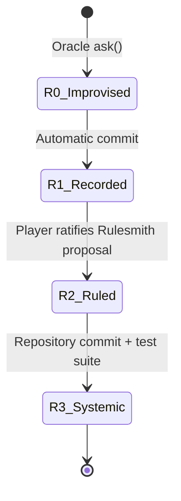

# The Ladder & Rule Vocabulary

The core evolutionary mechanism of `evolving-rpg` is **The Ladder**. The Ladder defines how game elements transition from fluid, model-generated improvisations into permanent canon, declarative rules, and hardcoded engine code.

---

## The Four Rungs



*Figure 1: State transitions of content and mechanics climbing the Ladder.*

### Rung Specifications

1. **R0 — Improvised**
   - **Definition**: Model decides content or behavior dynamically at runtime.
   - **Cost**: 1 model call (~1–3 seconds latency).
   - **Authority**: Oracle runtime responses.

2. **R1 — Recorded**
   - **Definition**: An improvised name, description, or detail saved into canon.
   - **Promotion Policy**: **Automatic.** When touched, details become fixed canon so the world does not contradict itself across turns.

3. **R2 — Ruled**
   - **Definition**: Generalized patterns extracted from R1 records into declarative data rules.
   - **Promotion Policy**: **Player Ratification.** The Rulesmith AI drafts proposals; the player accepts, edits, or rejects them in the Forge.
   - **Storage**: Carried directly inside `RULE_RATIFIED` events in the event log.

4. **R3 — Systemic**
   - **Definition**: R2 rules promoted into pure TypeScript engine code with comprehensive test coverage.
   - **Promotion Policy**: **Claude Code / Dev Session.** Performed in a repo run by developer and agent together, never dynamically at runtime.

---

## R2 Declarative Rule Vocabulary

To prevent untrusted model-generated rules from crashing, hanging, or corrupting the engine, R2 rules are represented strictly as **data conforming to a closed vocabulary** defined in `src/canon/rule.ts`.

### Closed Schema Union

```typescript
export const TRIGGERS = [
  'WAIT',          // you held still
  'MOVE',          // you took a step
  'MOVE_BLOCKED',  // you walked into something solid
  'STRIKE',        // you struck something
  'STRUCK',        // something struck you
  'KILLED',        // something died by your hand
  'ITEM_TAKEN',    // you picked something up
  'TURN_PASSED',   // a full round went by
] as const;
export type Trigger = (typeof TRIGGERS)[number];

export const STATS = ['might', 'speed', 'wits', 'maxHp'] as const;
export type StatName = (typeof STATS)[number];

export type Condition =
  | { readonly kind: 'hpAtMost'; readonly n: number }
  | { readonly kind: 'hpAtLeast'; readonly n: number }
  | { readonly kind: 'hpBelowPercent'; readonly n: number }
  | { readonly kind: 'hpAbovePercent'; readonly n: number }
  | { readonly kind: 'creatureWithin'; readonly n: number }
  | { readonly kind: 'noCreatureWithin'; readonly n: number }
  | { readonly kind: 'creaturesAtMost'; readonly n: number }
  | { readonly kind: 'creaturesAtLeast'; readonly n: number }
  | { readonly kind: 'exitWithin'; readonly n: number }
  | { readonly kind: 'exitBeyond'; readonly n: number }
  | { readonly kind: 'turnAtLeast'; readonly n: number }
  | { readonly kind: 'depthAtLeast'; readonly n: number }
  | { readonly kind: 'statAtLeast'; readonly stat: StatName; readonly n: number }
  | { readonly kind: 'motifIs'; readonly motif: MotifName }
  | { readonly kind: 'bodyHere' }
  | { readonly kind: 'blowLanded' }
  | { readonly kind: 'blowMissed' };

export type Effect =
  | { readonly kind: 'heal'; readonly n: number }
  | { readonly kind: 'harm'; readonly n: number }
  | { readonly kind: 'harmOther'; readonly n: number }
  | { readonly kind: 'grant'; readonly stat: StatName; readonly n: number }
  | { readonly kind: 'drain'; readonly stat: StatName; readonly n: number }
  | { readonly kind: 'push'; readonly n: number }
  | { readonly kind: 'speak'; readonly text: string };
```

An R2 `Rule` consists of:
- `id`: Unique rule string identifier.
- `when`: Single `Trigger` event type.
- `require`: List of `Condition` records (up to 4 per rule).
- `then`: List of `Effect` records (`heal`, `harm`, `harmOther`, `grant`, `drain`, `push`, `speak`, up to 3 per rule).
- `provenance`: Historical justification (`events[]`, `notes[]`, `because`).
- `ratifiedAt`: ISO timestamp string.

### Strict Safety Bounds & Shape Validation

`src/canon/rule.ts` enforces per-kind numerical bounds and structural integrity during validation:

```typescript
// Range limits per condition and effect kind
const RANGES: Record<string, readonly [number, number]> = {
  heal: [1, 20], harm: [1, 20], harmOther: [1, 20],
  grant: [1, 5], drain: [1, 5],
  push: [1, 3],
  hpAtMost: [1, 99], hpAtLeast: [1, 99],
  hpBelowPercent: [1, 99], hpAbovePercent: [1, 99],
  creatureWithin: [1, 40], noCreatureWithin: [1, 40],
  exitWithin: [1, 40], exitBeyond: [1, 40],
  creaturesAtMost: [0, 20], creaturesAtLeast: [0, 20],
  turnAtLeast: [1, 999],
  statAtLeast: [1, 20],
};

export const MAX_CONDITIONS = 4; // Maximum conditions per rule
export const MAX_EFFECTS = 3;    // Maximum effects per rule
export const MAX_TEXT = 120;     // Maximum text length for speak effects
export const MAX_BECAUSE = 240;  // Maximum provenance rationale length
export const MAX_RULES = 16;     // Maximum active rules in game state
```

In addition to range checks, `validateRule(input)` rejects incoherent rule shapes:
- **Blow conditions on non-blow triggers**: `blowLanded` or `blowMissed` are refused unless the trigger is `STRIKE` or `STRUCK`.
- **Target effects without an target**: `harmOther` and `push` require a trigger that has another party (e.g., `STRIKE` or `STRUCK`).

Any invalid rule proposal is converted to a `Rejected` payload (`{ rejected: string }`) without entering game state.

---

## Rule Assay & Covenant Invariants (`src/assay/`)

While structural validation (`validateRule`) checks if a rule is *well-formed*, it cannot prove that a rule is *sound* during play. To protect game balance and maintain the Covenant model (`src/assay/covenant.ts`), proposed rules undergo adversarial simulation via `assayRule` (`src/assay/ruleAssay.ts`) before being offered for player ratification:

1. **Trial of Greed (M2 Invariant)**: Drives an exploit policy (`brawler`/`bumper`) hammering the rule's trigger in a friendly world for 120 turns. Refuses any rule where stat gain exceeds `MAX_RULE_GAIN` (+6).
2. **Trial of the Coward (M1 Invariant)**: Drives a degenerate defense policy (`sitter`) where the player stands still while an attacker strikes. Refuses any rule that makes the player invincible while doing nothing.
3. **Trial of Function (M3 Invariant)**: Evaluates whether the rule fires during trials. If a rule never fires, it yields a *caution* (finding attached to verdict) rather than a hard refusal, allowing legitimate niche rules (e.g. `turnAtLeast 500`) to be over-ruled by the player.

Rules that pass the assay arrive as endorsed offers on the Wardens' bench (`runs/endorsed/`).

---

## Rule Interpreter Execution Semantics

The rule interpreter in `src/canon/interpret.ts` converts R2 rule data into active gameplay effects via `fireRules(state, trigger, actorId, blow)`.

### Core Interpreter Invariants

1. **Effects Resolved at Fire Time, Replayed via Concrete Outcomes**
   `fireRules` evaluates conditions and resolves target entities/positions at the exact instant of firing, producing concrete `Resolved` outcomes (`health`, `stat`, `move`, `said`) stored in the `outcomes` array of `RULE_FIRED` events. During replay, `applyResolved` in `src/canon/interpret.ts` (invoked by `apply` in `src/core/apply.ts`) executes concrete outcomes directly without re-evaluating conditions or re-deriving target positions or grid boundaries. This keeps past history stable as rules or map geometries evolve.

2. **Zero Randomness (`rngDraws: 0`)**
   Rule firing draws no random numbers. Every effect is a pure function of state and recorded rule parameters, so ratifying a new rule never shifts future RNG sequences or combat rolls.

3. **Strict Non-Cascading**
   `RULE_FIRED` is deliberately **not** a member of `Trigger`. A rule effect cannot trigger another rule, eliminating infinite execution loops by design.

4. **Player Scope Protection & Reactive Triggers**
   Triggers are defined relative to the player. `STRIKE` represents player attacks; `STRUCK` fires when an enemy attacks the player (allowing thorns, retaliation, or rage mechanics). Rules fire strictly on behalf of the player entity (`playerId`), avoiding accidental creature self-buffs or heals.

```typescript
// Condition check execution in src/canon/interpret.ts
export function holds(condition: Condition, state: GameState, actorId: string, blow: Blow = {}): boolean {
  const actor = findEntity(state.entities, actorId);
  if (actor === undefined) return false;

  switch (condition.kind) {
    case 'hpAtMost': return actor.stats.hp <= condition.n;
    case 'hpAtLeast': return actor.stats.hp >= condition.n;
    case 'hpBelowPercent': return actor.maxHp > 0 && (actor.stats.hp / actor.maxHp) * 100 < condition.n;
    case 'hpAbovePercent': return actor.maxHp > 0 && (actor.stats.hp / actor.maxHp) * 100 > condition.n;
    case 'creatureWithin': return nearestCreature(state, actorId) <= condition.n;
    case 'noCreatureWithin': return nearestCreature(state, actorId) > condition.n;
    case 'creaturesAtMost': return livingOthers(state, actorId) <= condition.n;
    case 'creaturesAtLeast': return livingOthers(state, actorId) >= condition.n;
    case 'exitWithin': return stepsToExit(state, actor.pos) <= condition.n;
    case 'exitBeyond': return stepsToExit(state, actor.pos) > condition.n;
    case 'turnAtLeast': return state.turn >= condition.n;
    case 'statAtLeast': return statOf(actor, condition.stat) >= condition.n;
    case 'blowLanded': return blow.hit === true;
    case 'blowMissed': return blow.hit === false;
  }
}
```

---

## Cross-Module Links

- Rule events are persisted directly into the event graph described in [Content-Addressed Event Log](/openwiki/domain/event-log.md).
- Rule evaluation timing within player turns is detailed in [Turn Execution Loop & Session Driver](/openwiki/workflows/turn-loop.md).
- Rulesmith drafting and AI prompt structures are documented in [Oracle & Feedback Channels](/openwiki/integrations/oracle-channels.md).
- Quickstart overview and navigation map can be found in [Quickstart Guide](/openwiki/quickstart.md).
