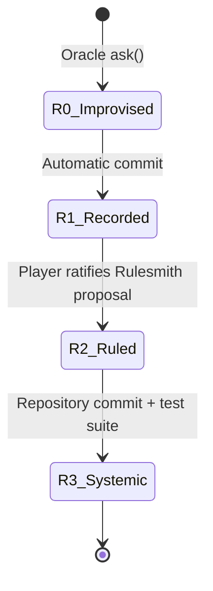

# The Ladder & Rule Vocabulary

The core evolutionary mechanism of `evolving-rpg` is **The Ladder**. The Ladder defines how game elements transition from fluid, model-generated improvisations into permanent canon, declarative rules, and hardcoded engine code.

---

## The Four Rungs



*Figure 1: State transitions of content and mechanics climbing the Ladder.*

### Rung Specifications

1. **R0 — Improvised**
   - **Definition**: Model decides content or behavior dynamically at runtime.
   - **Cost**: 1 model call (~1–3 seconds latency).
   - **Authority**: Oracle runtime responses.

2. **R1 — Recorded**
   - **Definition**: An improvised name, description, or detail saved into canon.
   - **Promotion Policy**: **Automatic.** When touched, details become fixed canon so the world does not contradict itself across turns.

3. **R2 — Ruled**
   - **Definition**: Generalized patterns extracted from R1 records into declarative data rules.
   - **Promotion Policy**: **Player Ratification.** The Rulesmith AI drafts proposals; the player accepts, edits, or rejects them in the Forge.
   - **Storage**: Carried directly inside `RULE_RATIFIED` events in the event log.

4. **R3 — Systemic**
   - **Definition**: R2 rules promoted into pure TypeScript engine code with comprehensive test coverage.
   - **Promotion Policy**: **Claude Code / Dev Session.** Performed in a repo run by developer and agent together, never dynamically at runtime.

---

## R2 Declarative Rule Vocabulary

To prevent untrusted model-generated rules from crashing, hanging, or corrupting the engine, R2 rules are represented strictly as **data conforming to a closed vocabulary** defined in `src/canon/rule.ts`.

### Closed Schema Union

```typescript
export const TRIGGERS = ['WAIT', 'STRIKE', 'MOVE_BLOCKED', 'ITEM_TAKEN'] as const;
export type Trigger = (typeof TRIGGERS)[number];

export const CONDITION_KINDS = ['noCreatureWithin', 'creatureWithin', 'hpAtMost', 'hpAtLeast'] as const;
export type ConditionKind = (typeof CONDITION_KINDS)[number];

export const EFFECT_KINDS = ['heal', 'harm', 'speak'] as const;
export type EffectKind = (typeof EFFECT_KINDS)[number];
```

An R2 `Rule` consists of:
- `id`: Unique rule string identifier.
- `when`: Single `Trigger` event type.
- `require`: List of `Condition` records (`{ kind, n }`).
- `then`: List of `Effect` records (`heal`, `harm`, or `speak`).
- `provenance`: Historical justification (`events[]`, `notes[]`, `because`).
- `ratifiedAt`: ISO timestamp string.

### Strict Safety Bounds

`src/canon/rule.ts` enforces hard numerical bounds during validation:

```typescript
export const MIN_N = 1;          // Minimum value for numeric parameters
export const MAX_N = 9;          // Maximum value for numeric parameters
export const MAX_CONDITIONS = 3; // Maximum conditions per rule
export const MAX_EFFECTS = 2;    // Maximum effects per rule
export const MAX_TEXT = 120;     // Maximum text length for speak effects
export const MAX_BECAUSE = 240;  // Maximum provenance rationale length
export const MAX_RULES = 16;     // Maximum active rules in game state
```

Any rule proposal exceeding these bounds is rejected by `validateRule(input)` and converted to a `Rejected` payload (`{ rejected: string }`) without entering game state.

---

## Rule Interpreter Execution Semantics

The rule interpreter in `src/canon/interpret.ts` converts R2 rule data into active gameplay effects via `fireRules(state, trigger, actorId)`.

### Core Interpreter Invariants

1. **Decided at Firing, Replayed via Events**
   `fireRules` evaluates conditions against `GameState` at the exact instant an action completes. When conditions pass, it emits a `RULE_FIRED` event carrying the exact effects (`heal`, `harm`, `speak`). During replay, the reducer `apply` in `src/core/apply.ts` executes the payload directly without re-evaluating conditions. This prevents new or modified rules from rewriting past history.

2. **Zero Randomness (`rngDraws: 0`)**
   Rule firing draws no random numbers. Ratifying a new rule never shifts future RNG sequences or combat rolls.

3. **Strict Non-Cascading**
   `RULE_FIRED` is deliberately **not** a member of `Trigger`. A rule effect cannot trigger another rule, eliminating infinite execution loops by design.

4. **Player Scope Protection**
   In [Turn Execution Loop & Session Driver](/openwiki/workflows/turn-loop.md), `commit` evaluates rules solely for player actions (`rulesFor = player.id`). Creatures cannot trigger player-ratified rules.

```typescript
// Condition check execution in src/canon/interpret.ts
export function holds(condition: Condition, state: GameState, actorId: string): boolean {
  const actor = findEntity(state.entities, actorId);
  if (actor === undefined) return false;

  switch (condition.kind) {
    case 'noCreatureWithin':
      return nearestCreature(state, actorId) > condition.n;
    case 'creatureWithin':
      return nearestCreature(state, actorId) <= condition.n;
    case 'hpAtMost':
      return actor.stats.hp <= condition.n;
    case 'hpAtLeast':
      return actor.stats.hp >= condition.n;
  }
}
```

---

## Cross-Module Links

- Rule events are persisted directly into the event graph described in [Content-Addressed Event Log](/openwiki/domain/event-log.md).
- Rule evaluation timing within player turns is detailed in [Turn Execution Loop & Session Driver](/openwiki/workflows/turn-loop.md).
- Rulesmith drafting and AI prompt structures are documented in [Oracle & Feedback Channels](/openwiki/integrations/oracle-channels.md).
- Quickstart overview and navigation map can be found in [Quickstart Guide](/openwiki/quickstart.md).
