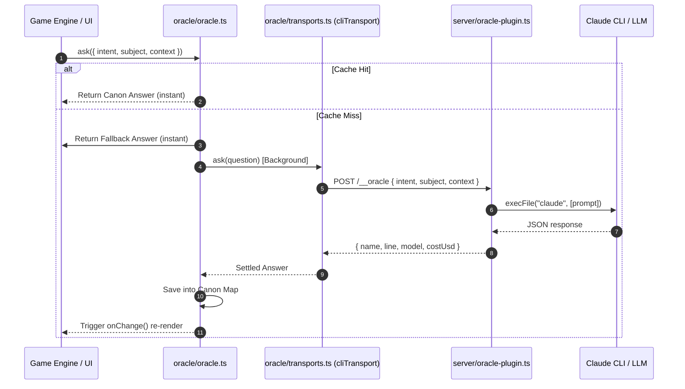

# Oracle & Feedback Channels

The **Oracle** (`src/oracle/oracle.ts`) is the single boundary through which language models touch `evolving-rpg`. It is designed around three strict invariants that prevent model latency or availability issues from degrading gameplay:

1. **Never Block a Turn**: Mechanics resolve instantly; narrative prose arrives asynchronously.
2. **The Cache is the Canon**: Questions are keyed by `{ intent, subject }`. Cached model responses form the permanent world canon.
3. **Deterministic Fallbacks**: Every query has an instant, offline fallback generator (`fallbackFor`).

---

## Oracle Query Lifecycle & Transports



*Figure 1: Complete query resolution pipeline from instant fallback return to background LLM completion.*

---

## Transports Architecture (`src/oracle/transports.ts`)

Transports implement a unified interface (`Transport`):

```typescript
export interface Transport {
  readonly name: string;
  ask(question: Question): Promise<{
    name: string;
    line: string;
    model?: string | null;
    costUsd?: number;
  }>;
}
```

### Available Transport Implementations

1. **`cliTransport` (Development Default)**
   Sends requests via HTTP `POST /__oracle` to the Vite dev server plugin. Requires no API keys—bills against whichever account is active in the host `claude` CLI.
2. **`stubTransport` (Test Harness)**
   Generates stable, deterministic mock answers derived from the subject string. Used in all Vitest suites so no test touches the network.
3. **`brokenTransport` (Resilience Verification)**
   Always rejects queries, proving that gameplay survives complete model outages.
4. **`sdkTransport` / `artifactTransport`**
   Optional transports for direct Anthropic API key usage or inlined `window.claude.complete` artifact execution.

---

## Dev Server Oracle Proxy (`server/oracle-plugin.ts`)

The Vite plugin `oraclePlugin` exposes the `/__oracle` endpoint:

- **CLI Shell-Out**: Executes `execFile('claude', ['-p', prompt])` with a 45-second timeout.
- **Strict JSON Prompting**: Instructs the model to output *only* raw JSON containing `name` (concrete noun, $\le 4$ words) and `line` (second-person description, $\le 20$ words).
- **Extraction Guard**: `extract(text)` parses JSON from the CLI output and validates required fields before returning data to the client.

---

## Feedback Channels (`src/channels/channels.ts`)

`evolving-rpg` provides two distinct communication channels for capturing user input alongside game state:

```typescript
export type Channel = 'designer' | 'gamemaster';

export interface Note {
  channel: Channel;
  said: string;
  reply: string | null;
  trouble: string | null;
  world: string;
  head: string | null;
  turn: number;
  at: string; // ISO timestamp
}
```

### Channel Roles

1. **`designer` Channel**
   - **Role**: Out-of-world feedback regarding balance, feel, or bug reports (e.g., *"The wall bump damage feels unfair"*).
   - **Execution**: Recorded locally with exact world head position and turn index. Used as fitness signals for Critic metrics.

2. **`gamemaster` Channel**
   - **Role**: In-world queries in second-person prose (e.g., *"What does the ash smell like?"*).
   - **Execution**: Sends query to `Oracle.consult()` using the `gamemaster` intent. Answers are narrative only and do not alter state or commit canon events.

---

## Cross-Module Links

- System layer dependencies are detailed in [System Architecture Overview](/openwiki/architecture/overview.md).
- R2 Rulesmith AI proposals are governed by [The Ladder & Rule Vocabulary](/openwiki/domain/ladder.md).
- Action turn timing and event logs are documented in [Turn Execution Loop & Session Driver](/openwiki/workflows/turn-loop.md).
- Development server setup and plugin configuration are detailed in [Operations & Testing Runbook](/openwiki/operations/testing-runbook.md).
