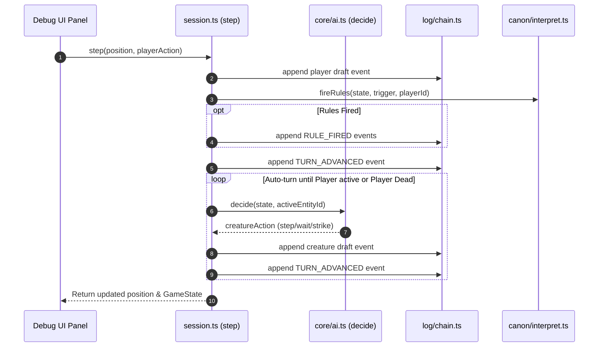

# Turn Execution Loop & Session Driver

The core gameplay loop in `evolving-rpg` is managed by `src/play/session.ts`. It acts as the orchestration driver that translates player input and AI creature decisions into validated game events, rule checks, turn advancements, and state updates.

---

## The Turn Resolution Lifecycle

A turn begins when the player executes an action (movement, attack, picking up an item, or waiting).

*Figure 1: Complete execution flow of player action resolution and automated creature turn processing.*

---

## Action Drafting & Execution (`commit` and `step`)

### Action Drafting (`draftFor`)

Actions are turned into draft events via `draftFor`:
- **Step (`step`)**: Invokes `attemptMove(state, entityId, dx, dy)`. If the target cell is occupied by a hostile entity, `attemptMove` automatically converts the move into a `STRIKE` command.
- **Wait (`wait`)**: Returns a `WAIT` event draft.
- **Item Pick Up**: Standing on an item automatically triggers `takeUnderfoot(state, entityId)`, emitting an `ITEM_TAKEN` event that applies item stats grants.

### Event Commit Pipeline (`commit`)

`commit(position, draft, rulesFor)` executes a 3-step pipeline:

1. **Append Action**: Appends the primary action `draft` to the log.
2. **Evaluate Rules**: If `rulesFor` is specified (player actions only), calls `fireRules` in `src/canon/interpret.ts` for the matching trigger (`WAIT`, `STRIKE`, `MOVE_BLOCKED`, or `ITEM_TAKEN`). Appends any fired rule events.
3. **Advance Turn**: If `endsTurn(draft)` is true, appends a `TURN_ADVANCED` event to pass initiative to the next active entity according to speed stat order (`src/core/turns.ts`).

---

## Combat Mechanics & AI Decision Engine

### Melee Combat Resolution (`src/core/commands.ts`)

When an entity steps into an enemy cell, combat resolves deterministically:

$$\text{Damage} = \max\left(1, \text{Attacker.Might} - \lfloor \text{Defender.Wits} / 2 \rfloor\right)$$

HP reduction is applied via `modifyHp` in `src/core/entity.ts`. If defender HP drops to 0 or below, the entity's status transitions to dead (`isAlive = false`).

### AI Creature Behaviour (`src/core/ai.ts`)

During `autoTurn`, creature AI decisions are produced by `decide(state, creatureId)`:
1. Locates player entity in `state.entities`.
2. Computes Manhattan distance to player.
3. If distance is 1 step, returns a `step` action toward player (triggering combat strike).
4. If player is within reachability bounds, calculates step along shortest path using BFS grid search (`src/core/reachability.ts`).
5. If player is unreachable or blocked, returns `wait`.

---

## Mortality Mechanics & Death Rewinds

In `evolving-rpg`, player death does not delete the world or end the run.

### Death Rewind Logic (`rewindOnDeath`)

When `player.stats.hp <= 0`:
1. The driver identifies the current dead branch ref.
2. Creates a rewind ref pointing back to the initial `WORLD_INIT` head or last safe world checkpoint.
3. The branch where the player died remains permanently in the event log history.

This design gives forking a tangible gameplay role: previous failed attempts survive in history for player review and Critic metric analysis.

---

## Session Storage & Persistence (`src/play/store.ts`)

Game sessions are saved to browser `LocalStorage` under key `evolving-rpg/session/v1`:

- **`serialise(log, refs, active, savedAt)`**: Collects all unique events reachable across all world refs and sorts them by sequence number `seq`.
- **`deserialise(saved)`**: Reconstructs `EventLog` and `Refs` maps, then runs `verifyChain` on every world ref to ensure historical integrity.
- **Corrupt Save Handling**: If `verifyChain` finds a hash mismatch or sequence divergence, `deserialise` throws an error and refuses to load the corrupted save.

---

## Cross-Module Links

- Overall architecture layers are detailed in [System Architecture Overview](/openwiki/architecture/overview.md).
- R2 rule evaluation during `commit` is specified in [The Ladder & Rule Vocabulary](/openwiki/domain/ladder.md).
- Event log structure and hash verification are documented in [Content-Addressed Event Log](/openwiki/domain/event-log.md).
- Session storage plugins and test execution are detailed in [Operations & Testing Runbook](/openwiki/operations/testing-runbook.md).
