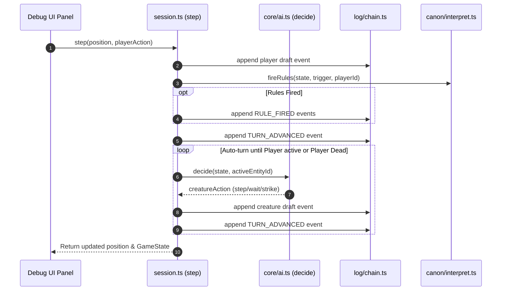

# Turn Execution Loop & Session Driver

The core gameplay loop in `evolving-rpg` is managed by `src/play/session.ts`. It acts as the orchestration driver that translates player input and AI creature decisions into validated game events, rule checks, turn advancements, and state updates.

---

## The Turn Resolution Lifecycle

A turn begins when the player executes an action (movement, attack, picking up an item, or waiting).

*Figure 1: Complete execution flow of player action resolution and automated creature turn processing.*

---

## Action Drafting & Execution (`commit` and `step`)

### Action Drafting (`draftFor`)

Actions are turned into draft events via `draftFor`:
- **Step (`step`)**: Invokes `attemptMove(state, entityId, dx, dy)`. If the target cell is occupied by a hostile entity, `attemptMove` automatically converts the move into a `STRIKE` command or, for a player in `drawn` stance at range 2+, a `shoot` that resolves as a ranged STRIKE.
- **Wait (`wait`)**: Returns a `WAIT` event draft. A drawn archer who waits stays drawn — `WAIT` is the deliberate exception that preserves the stance.
- **Draw (`draw`)**: Enters `DRAWN` stance, which enables ranged attacks via `looseShot`. Stance clears on any non-wait action.
- **Item Pick Up**: Standing on an item automatically triggers `takeUnderfoot(state, entityId)`, emitting an `ITEM_TAKEN` event that applies item stats grants. On walk-over, items are refused silently; deliberate pick-up attempts (`takeOrRefuse`) emit `ITEM_REFUSED` when the floor is bare or the satchel is full.
- **Scroll Read**: `readScroll` consumes a carried scroll, emitting a `SCROLL_READ` event that unveils secret doors or triggers scroll-specific effects (blink teleport, sunder damage, trap eater).
- **Trap Interaction**: Moving onto a trap triggers `springTrap`, emitting `TRAP_SPRUNG` with damage or status effects. Standing near a trap with sufficient wits may emit `TRAP_SENSED`, revealing it on the debug UI.

### Event Commit Pipeline (`commit`)

`commit(position, draft, actorId, playerId)` executes a multi-step pipeline:

1. **Append Action**: Appends the primary action `draft` to the log and folds state to inspect the resulting world (`afterAction`).
2. **Evaluate Rules (`firingFor`)**: Maps the draft event and post-action state to a rule firing context (`trigger`, `actorId`, `blow`):
   - **Player Actions (`WAIT`, `MOVE`, `MOVE_BLOCKED`, `ITEM_TAKEN`)**: Emits corresponding triggers for player-initiated non-combat actions.
   - **Combat Attacks (`STRIKE`, `STRUCK`, `KILLED`)**:
     - When the player swings, if the blow kills the target, it emits `KILLED` (and only `KILLED`, avoiding double-firing with `STRIKE`). Otherwise, it emits `STRIKE`.
     - When an enemy swings at the player, it emits `STRUCK`, allowing reactive rules (such as thorns or retaliation) to fire on the player's behalf during enemy turns.
   - **Rule Firing**: Calls `fireRules(afterAction, trigger, actorId, blow)` and appends any emitted `RULE_FIRED` events carrying resolved concrete outcomes (`health`, `stat`, `move`, `said`).
3. **Advance Turn & Pass Round (`TURN_PASSED`)**: If `endsTurn(draft)` is true, appends a `TURN_ADVANCED` event to pass initiative according to speed order (`src/core/turns.ts`). If a full round completed (`after.turn !== before.turn`), evaluates `TURN_PASSED` rules once for the round.

---

## Combat Mechanics & AI Decision Engine

### Melee Combat Resolution (`src/core/commands.ts` & `src/core/tables.ts`)

When an entity steps into an enemy cell, combat resolves deterministically using bounded accuracy dice tables (`src/core/tables.ts`):

1. **Target Roll (`neededToHit`)**:
   $$\text{Needed} = \text{clamp}(10 + \text{Defender.Speed} - \text{Attacker.Might},\, 4,\, 17)$$
2. **d20 Check**:
   - **Crit (`CRIT`)**: Natural 20 (or $\ge$ `critFloor(wits)` down to 18) always hits and doubles damage.
   - **Whiff (`WHIFF`)**: Natural 1 always misses regardless of stat advantage.
   - **Hit**: Roll $\ge \text{Needed}$ lands a blow; damage is drawn from `DamageDice` based on attacker Might band.
3. **Tactical Verbs**: Players can perform non-dice positional stance actions including `shove` (pushes target back 1 tile) and `brace` (defensive stance). Creatures feature specialized verbs (`trample`, `lunge`, `ambush`, `vigil`, `stinger`, `caller`).

HP reduction is applied via `modifyHp` in `src/core/entity.ts`. Defeating enemies grants XP; filling the XP bar triggers a level-up restoring HP. If defender HP drops to 0 or below, the entity transitions to dead (`isAlive = false`). When a creature dies, its **pocket** — what it carried, drawn at WORLD_INIT v14 — spills onto a neighbouring floor tile (or is swallowed if every adjacent tile is occupied). When a run ends (victory or death), the Chronicler (`src/canon/chronicler.ts`) generates a validated story payload recorded into the chain as a `CHRONICLE_WRITTEN` event.

### Ranged Combat & The Volley Discipline

Ranged combat is governed by the **volley discipline** (Covenant M7: distance is honest; M8: announced). The key primitives:

1. **Draw Stance (`DRAWN`)**: `drawStance` requires the player to wield a ranged weapon (a relic with the `sling` trait). It sets the `drawn` tag and records a `DRAWN` event. The stance clears on any non-`WAIT` action.
2. **Shot Resolution (`looseShot`)**: When a drawn player steps toward a hostile at range 2+, the move auto-converts to a ranged `STRIKE` instead of melee. `looseShot` validates that `clearShot` holds (supercover line-of-sight, `src/core/sight.ts`) and that the target is within `SHOT_RANGE` (5 tiles by the fog's circle metric, `withinReach`). A `STRIKE` event records the roll identically to melee.
3. **Slinger AI**: The `slinger` creature archetype (`verb: 'volley'`, from depth 2) draws and shoots from range. Its AI in `decide` prefers ranged attacks when a clear shot exists.

Combat also supports a `ward` provision: wearing one grants the `warded` tag, which absorbs one landing blow entirely (damage set to 0, recorded as `warded: true` on the STRIKE payload).

### AI Creature Behaviour (`src/core/ai.ts`)

During `autoTurn`, creature AI decisions are produced by `decide(state, creatureId)`. The engine is deliberately **deterministic and drawless** — randomness belongs in whether a blow lands, not in whether a creature decides to throw it.

The shared hunt uses BFS pathfinding (`firstStep`) out to `AWARENESS` (8 walking steps), respecting walls and occupied tiles. Each archetype layers its behaviour on top:

1. **Basic hunters** (`trample`, `lunge`, `ambush`, `venom`): Follow the hunt toward the player. Specific verbs add behaviour at strike time (trample's shove, lunge's two-tile strike, ambush's spring-loaded first blow).
2. **Slinger (`volley`)**: Prefers ranged attacks — draws if not drawn, shoots if a `clearShot` exists within `SHOT_RANGE`, or hunts toward the player otherwise.
3. **Dispositions (v10)**: Creatures with a `disposition` field on their `EntitySeed` have constrained movement:
   - **Guard**: Hunts only within `GUARD_LEASH` of its post. When prey leaves the leash, it walks home. A guard that never sees the player stands still.
   - **Wanderer**: Walks a fixed `route[]` of waypoints drawn at generation, cycling through them round by round. It hunts if prey enters awareness, then resumes its route.
4. **Mimic (`feign`, v11)**: Born with the `hidden` tag and a `guise` (an item kind it displays). It does nothing while hidden — no hunt, no drift, no tell. When the player steps adjacent, an `UNMASKED` event strips the tag and loads the ambush spring. Once revealed, it fights like a stalker.
5. **Warden (`vigil`)**: Leashed to its post within `VIGIL_LEASH`. Pursues intruders, walks home when the leash empties, and mends HP when standing at its post unwatched and wounded.
6. **Caller (`call`)**: When prey is within `CALL_RANGE`, emits a `CALLED` event that raises `CALL_RISERS` new creatures from nearby exits within `CALL_DISTANCE`.
7. **Staggered creatures**: Any creature with the `staggered` tag spends its turn waiting — one stagger, one lost turn.

---

## Special Floor Mechanics

Beyond combat, the dungeon floor includes several distinct interactive systems:

- **Traps (v12)**: Generated at `WORLD_INIT` with `kind`, `pos`, and `level`. Each trap offers one chance to be sensed — a `sight` roll when first visible (wits-based, via `TRAP_NEED`), and a `near` roll when stepped adjacent. Success emits `TRAP_SENSED` revealing it on the UI; walking onto it emits `TRAP_SPRUNG` with damage (spike), venom (needle), a snare (staggered), or an alarm (floor-wide awareness). The `TRAP_EATER` scroll destroys one trap within range.
- **Mimics (v11)**: Items that were never items. Generated via `MIMIC_IN` chance at depth 2+. Displays a `guise` (item kind) on the render side while the creature underneath carries the `hidden` tag. Stepping adjacent triggers `UNMASKED` — the guise vanishes, the tag strips, and the mimic fights with an ambush spring loaded.
- **Secret Doors**: `SECRET` tiles generated during mapgen behave as walls until trodden, at which point they become passable. The `SCROLL_READ` event with a `BLINK` or unveil effect can name secret doors in `state.unveiled`, rendering them visible but still occluding until walked through.
- **Smoke**: The `smoke` provision sets `state.smoke` with an `until` turn and `at` position. Fooled creatures hunt the smoke position rather than the player, and each creature that reaches it is added to `unfooled` so it cannot be fooled again by the same smoke cloud.

In `evolving-rpg`, player death does not delete the world or end the run.

### Death Rewind Logic (`rewindOnDeath`)

When `player.stats.hp <= 0`:
1. The driver identifies the current dead branch ref.
2. Creates a rewind ref pointing back to the initial `WORLD_INIT` head or last safe world checkpoint.
3. The branch where the player died remains permanently in the event log history.

This design gives forking a tangible gameplay role: previous failed attempts survive in history for player review and Critic metric analysis.

---

## Session Storage & Persistence (`src/play/store.ts`)

Game sessions are saved to browser `LocalStorage` under key `evolving-rpg/session/v1`:

- **`serialise(log, refs, active, savedAt)`**: Collects all unique events reachable across all world refs and sorts them by sequence number `seq`.
- **`deserialise(saved)`**: Reconstructs `EventLog` and `Refs` maps, then runs `verifyChain` on every world ref to ensure historical integrity.
- **Corrupt Save Handling**: If `verifyChain` finds a hash mismatch or sequence divergence, `deserialise` throws an error and refuses to load the corrupted save.

---

## Cross-Module Links

- Overall architecture layers are detailed in [System Architecture Overview](/openwiki/architecture/overview.md).
- R2 rule evaluation during `commit` is specified in [The Ladder & Rule Vocabulary](/openwiki/domain/ladder.md).
- Event log structure and hash verification are documented in [Content-Addressed Event Log](/openwiki/domain/event-log.md).
- Session storage plugins and test execution are detailed in [Operations & Testing Runbook](/openwiki/operations/testing-runbook.md).
